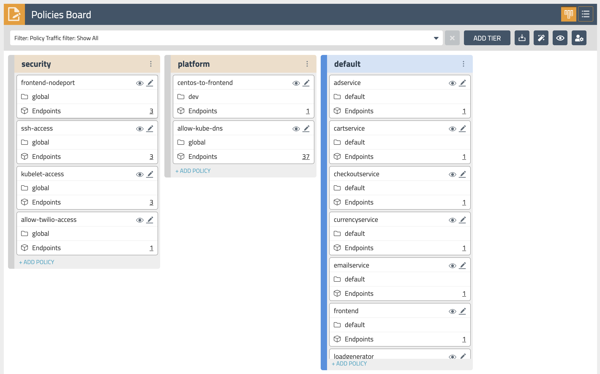

# Hands-on-workshop-for-Kubernetes-observability

## Use cases

In this workship we are going to focus on these main use cases:

- Dynamic Service Graph for run-time visualization of flow and policies 
- DNS dashboards for quick troubleshooting 
- Dynamic Packet Capture to analyze traffic on a pod or collection of pods live 
- Application (L7) observability


## Prerequisites 
1. Download this repo into your environment:

```bash
 git clone https://github.com/JosephYostos/Hands-on-workshop-for-Kubernetes-observability.git  
```
2. Configure log aggregation and flush intervals.

```bash
 kubectl patch felixconfiguration.p default -p '{"spec":{"flowLogsFlushInterval":"10s"}}'
 kubectl patch felixconfiguration.p default -p '{"spec":{"dnsLogsFlushInterval":"10s"}}'
 kubectl patch felixconfiguration.p default -p '{"spec":{"flowLogsFileAggregationKindForAllowed":1}}'
```

3. Configure Felix for log data collection.

    >[Felix](https://docs.tigera.io/reference/architecture/overview#felix) is one of Calico components that is responsible for configuring routes, ACLs, and anything else required on the host to provide desired connectivity for the endpoints on that host.

```bash
 kubectl patch felixconfiguration default --type='merge' -p '{"spec":{"policySyncPathPrefix":"/var/run/nodeagent","l7LogsFileEnabled":true}}'
```
    
## Module 0: Observability tools overview

**Goal:** Explore Calico observability tools.

## Calico observability tools

>If you are interested in enabling collection of application layer metrics for your workloads, refer to [Configure L7 logs](https://docs.tigera.io/visibility/elastic/l7/configure) documentation to enable application layer metrics collection.

1. Dashboard

    The `Dashboard` view in the Enterprise Manager UI presents high level overview of what's going on in your cluster. The view shows the following information:

    - Connections, Allowed Bytes and Packets
    - Denied Bytes and Packets
    - Total number of Policies, Endpoints and Nodes
    - Summary of CIS benchmarks
    - Count of triggered alerts
    - Packets by Policy histogram that shows allowed and denied traffic as it is being evaluated by network policies

    

2. Policies Board

    The `Policies Board` shows all policies deployed in the cluster and organized into `policy tiers`. You can control what a user can see and do by configuring Kubernetes RBAC roles which determine what the user can see in this view. You can also use controls to hide away tiers you're not interested in at any given time.

    

    By leveraging stats controls you can toggle additional metrics to be listed for each shown policy.

    

3. Audit timeline

    The `Timeline` view shows audit trail of created, deleted, or modified resources.

    

4. Endpoints

    The `Endpoints` view lists all endpoints known to Calico. It includes all Kubernetes endpoints, such as Pods, as well as Host endpoints that can represent a Kubernetes host or an external VM or bare metal machine.

    

5. Service Graph

    The dynamic `Service Graph` presents network flows from service level perspective. Top level view shows how traffic flows between namespaces as well as external and internal endpoints.

    

    - When you select any node representing a namespace, you will get additional details about the namespace, such as incoming and outgoing traffic, policies evaluating each flow, and DNS metrics.
    - When you select any edge, you will get details about the flows representing that edge.
    - If you expand a namespace by double-clicking on it, you will get the view of all components of the namespace.

6. Flow Visualizations

    The `Flow Visualizations` view shows all point-to-point flows in the cluster. It allows you to see the cluster traffic from the network point of view.

    

7. Kibana dashboards

    The `Kibana` components comes with Calico commercial offerings and provides you access to raw flow, audit, and dns logs, as well as ability to visualize the collected data in various dashboards.

    

Some of the default dashboards you get access to are DNS Logs, Flow Logs, Audit Logs, Kuernetes API calls, L7 HTTP metrics, and others.

# Module 1: Configuring Environment

## Requirements:

1. security and Kubernetes platform policies should be evaluated before any other policies.
2. kubernetes platform team require an explicitly allow workloads to connect to kubernetes DNS component.
3. online boutique microservices application to be deploied in default namespace & dev application to be deploied in dev namespace.


## Steps

1. Deploy policy tiers.

    We are going to deploy some policies into policy tier to take advantage of hierarcical policy management.

    ```bash
    kubectl apply -f demo/tiers/tiers.yaml
    ```

    This will add tiers `security` and `platform` to the Calico cluster.

2. Deploy base policy.

    In order to explicitly allow workloads to connect to the Kubernetes DNS component, we are going to implement a policy that controls such traffic.

    ```bash
    kubectl apply -f demo/10-security-controls/allow-kube-dns.yaml
    ```

3. Deploy applications.

    ```bash
    # deploy dev app stack
    kubectl apply -f demo/dev/app.manifests.yaml

    # deploy boutiqueshop app stack
    kubectl apply -f https://raw.githubusercontent.com/GoogleCloudPlatform/microservices-demo/master/release/kubernetes-manifests.yaml
    ```

4. Deploy global alerts.

    >The alerts will be explored in a later lab.

    ```bash
    kubectl apply -f demo/50-alerts/globalnetworkset.changed.yaml
    kubectl apply -f demo/50-alerts/unsanctioned.dns.access.yaml
    kubectl apply -f demo/50-alerts/unsanctioned.lateral.access.yaml
    ```

# Module : Enable L7 Logs 

L7 logs capture application interactions from HTTP header data in requests. Data shows what is actually sent in communications between specific pods, providing more specificity than flow logs. (Flow logs capture data only from connections for workload interactions).

Calico collects L7 logs by sending the selected traffic through an Envoy proxy.

## Steps

1. create a Kubernetes pull secret for accessing Calico images, this should be provided by Tigera Team

    ```bash
    kubectl create secret generic tigera-pull-secret -n <application pod namespace> --from-file=.dockerconfigjson=<path/to/pull/secret> --type kubernetes.io/dockerconfigjson
    ```
2. Download the patch file to patch-envoy.yaml.

    ```bash
    curl https://docs.tigera.io/v3.7/manifests/l7/patch-envoy.yaml -O
    ```
3. Download the Envoy config.

    ```bash
    curl https://docs.tigera.io/v3.7/manifests/l7/envoy-config.yaml -O
    ```

4. Create the Envoy config.

    ```bash
    kubectl create configmap envoy-config -n <application pod namespace> --from-file=envoy-config.yaml
    ```
5. Configure Felix for log data collection.

    ```bash
    kubectl patch felixconfiguration default --type='merge' -p '{"spec":{"policySyncPathPrefix":"/var/run/nodeagent"}}'
    ```
6.  Install the envoy log collector

    ```bash
    kubectl patch deployment <name of application deployment> -n <namespace> --patch "$(cat patch-envoy.yaml)"
    ```

# Module 2: Using security controls

**Goal:** Leverage network policies to segment connections within Kubernetes cluster and prevent known bad actors from accessing the workloads.


## Requirements:
1. Security Team require applying rule to disable all traffic by default.
2. Dev team provided their application trtaffic reqirements and only connections between the components within each namespaces should be allowed as configured by the policies.

## Steps

1. Test connectivity between application components and across application stacks.

    a. Test connectivity between workloads within each namespace.

    ```bash
    # test connectivity within dev namespace
    kubectl -n dev exec -t centos -- sh -c 'curl -m3 -sI http://nginx-svc 2>/dev/null | grep -i http'

    # test connectivity within default namespace
    kubectl exec -it $(kubectl get po -l app=loadgenerator -ojsonpath='{.items[0].metadata.name}') -- sh -c 'curl -m3 -sI frontend 2>/dev/null | grep -i http'

    kubectl exec -it $(kubectl get po -l app=frontend -ojsonpath='{.items[0].metadata.name}') -c server -- sh -c 'nc -zv productcatalogservice 3550'
    ```

    b. Test connectivity across namespaces.

    ```bash
    # test connectivity from dev namespace to default namespace
    kubectl -n dev exec -t centos -- sh -c 'curl -m3 -sI http://frontend.default 2>/dev/null | grep -i http'

    # test connectivity from default namespace to dev namespace
    kubectl exec -it $(kubectl get po -l app=loadgenerator -ojsonpath='{.items[0].metadata.name}') -- sh -c 'curl -m3 -sI http://nginx-svc.dev 2>/dev/null | grep -i http'
    ```

    c. Test connectivity from each namespace to the Internet.

    ```bash
    # test connectivity from dev namespace to the Internet
    kubectl -n dev exec -t centos -- sh -c 'curl -m3 -sI http://www.google.com 2>/dev/null | grep -i http'

    # test connectivity from default namespace to the Internet
    kubectl exec -it $(kubectl get po -l app=loadgenerator -ojsonpath='{.items[0].metadata.name}') -- sh -c 'curl -m3 -sI www.google.com 2>/dev/null | grep -i http'
    ```

    All of these tests should succeed if there are no policies in place to govern the traffic for `dev` and `default` namespaces.

2. Apply staged `default-deny` policy.

    >Staged `default-deny` policy is a good way of catching any traffic that is not explicitly allowed by a policy without explicitly blocking it.

    ```bash
    kubectl apply -f demo/10-security-controls/staged.default-deny.yaml
    ```

    You should be able to view the potential affect of the staged `default-deny` policy if you navigate to the `Dashboard` view in the Enterprise Manager UI and look at the `Packets by Policy` histogram.

    ```bash
    # make a request across namespaces and view Packets by Policy histogram
    for i in {1..10}; do kubectl -n dev exec -t centos -- sh -c 'curl -m3 -sI http://frontend.default 2>/dev/null | grep -i http'; sleep 2; done
    ```

    >The staged policy does not affect the traffic directly but allows you to view the policy impact if it were to be enforced.

3. Apply network policies to control East-West traffic.

    ```bash
    # deploy dev policies
    kubectl apply -f demo/dev/policies.yaml

    # deploy boutiqueshop policies
    kubectl apply -f demo/boutiqueshop/policies.yaml
    ```

    Now as we have proper policies in place, we can enforce `default-deny` policy moving closer to zero-trust security approach. You can either enforced the already deployed staged `default-deny` policy using the `Policies Board` view in the Enterirpse Manager UI, or you can apply an enforcing `default-deny` policy manifest.

    ```bash
    # apply enforcing default-deny policy manifest
    kubectl apply -f demo/10-security-controls/default-deny.yaml
    # you can delete staged default-deny policy
    kubectl delete -f demo/10-security-controls/staged.default-deny.yaml
    ```

4. Test connectivity with policies in place.

    a. The only connections between the components within each namespaces should be allowed as configured by the policies.

    ```bash
    # test connectivity within dev namespace
    kubectl -n dev exec -t centos -- sh -c 'curl -m3 -sI http://nginx-svc 2>/dev/null | grep -i http'

    # test connectivity within default namespace
    kubectl exec -it $(kubectl get po -l app=loadgenerator -ojsonpath='{.items[0].metadata.name}') -- sh -c 'curl -m3 -sI frontend 2>/dev/null | grep -i http'
    ```

    b. The connections across `dev` and `default` namespaces should be blocked by the global `default-deny` policy.

    ```bash
    # test connectivity from dev namespace to default namespace
    kubectl -n dev exec -t centos -- sh -c 'curl -m3 -sI http://frontend.default 2>/dev/null | grep -i http'

    # test connectivity from default namespace to dev namespace
    kubectl exec -it $(kubectl get po -l app=loadgenerator -ojsonpath='{.items[0].metadata.name}') -- sh -c 'curl -m3 -sI http://nginx-svc.dev 2>/dev/null | grep -i http'
    ```

    c. The connections to the Internet should be blocked by the configured policies.

    ```bash
    # test connectivity from dev namespace to the Internet
    kubectl -n dev exec -t centos -- sh -c 'curl -m3 -sI http://www.google.com 2>/dev/null | grep -i http'

    # test connectivity from default namespace to the Internet
    kubectl exec -it $(kubectl get po -l app=loadgenerator -ojsonpath='{.items[0].metadata.name}') -- sh -c 'curl -m3 -sI www.google.com 2>/dev/null | grep -i http'
    ```
    
 # Module 3: Using egress access controls


## Problem:
1. Few days later Dev team requested allowing TCP traffic between centos in dev ns and frontend service in default ns.
2. it is also requested to allow centos pod to access api.twilio.com externally.

## Steps

1. Test connectivity within the cluster and to the external endpoint.

    a. Test connectivity between `dev/centos` pod and `default/frontend` pod.

    ```bash
    # test connectivity from dev namespace to default namespace
    kubectl -n dev exec -t centos -- sh -c 'curl -m3 -sI http://frontend.default 2>/dev/null | grep -i http'
    ```

    b. Test connectivity from `dev/centos` to the external endpoint.

    ```bash
    # test connectivity from dev namespace to the Internet
    kubectl -n dev exec -t centos -- sh -c 'curl -m3 -sI http://www.google.com 2>/dev/null | grep -i http'
    ```

    The access should be denied as the policies configured in previous module do not allow it.

2. Implement egress policy to allow egress access from a workload in one namespace, e.g. `dev/centos`, to a service in another namespace, e.g. `default/frontend`.

    a. Deploy egress policy.

    ```bash
    kubectl apply -f demo/20-egress-access-controls/centos-to-frontend.yaml
    ```

    b. Test connectivity between `dev/centos` pod and `default/frontend` service.

    ```bash
    kubectl -n dev exec -t centos -- sh -c 'curl -m3 -sI http://frontend.default 2>/dev/null | grep -i http'
    ```

    The access should be allowed once the egress policy is in place.

3. Implement DNS policy to allow the external endpoint access from a specific workload, e.g. `dev/centos`.

    a. Apply a policy to allow access to `api.twilio.com` endpoint using DNS rule.

    ```bash
    # deploy dns policy
    kubectl apply -f demo/20-egress-access-controls/dns-policy.yaml

    # test egress access to api.twilio.com
    kubectl -n dev exec -t centos -- sh -c 'curl -m3 -skI https://api.twilio.com 2>/dev/null | grep -i http'
    # test egress access to www.google.com
    kubectl -n dev exec -t centos -- sh -c 'curl -m3 -skI https://www.google.com 2>/dev/null | grep -i http'
    ```

    Access to the `api.twilio.com` endpoint should be allowed by the DNS policy but not to any other external endpoints like `www.google.com` unless we modify the policy to include that domain name.

    b. Edit the policy to use a `NetworkSet` instead of inline DNS rule.

    ```bash
    # deploy network set
    kubectl apply -f demo/20-egress-access-controls/netset.external-apis.yaml
    # deploy DNS policy using the network set
    kubectl apply -f demo/20-egress-access-controls/dns-policy.netset.yaml
    ```

    >As a bonus example, you can modify the `external-apis` network set to include `*.google.com` domain name which would allow access to Google subdomains. If you do it, you can would allow acess to subdomains like `www.google.com`, `docs.google.com`, etc.

# Module 4: Dynamic packet capture

**Goal:** Configure packet capture for specific pods and review captured payload.

## Steps

1. Configure packet capture.

    Navigate to `demo/60-packet-capture` and review YAML manifests that represent packet capture definition. Each packet capture is configured by deploing a `PacketCapture` resource that targets endpoints using `selector` and `labels`.

    Deploy packet capture definition to capture packets for `dev/nginx` pods.

    ```bash
    kubectl apply -f demo/60-packet-capture/nginx-pcap.yaml
    ```

    >Once the `PacketCapture` resource is deployed, Calico starts capturing packets for all endpoints configured in the `selector` field.

2. Install `calicoctl` CLI

    The easiest way to retrieve captured `*.pcap` files is to use [calicoctl](https://docs.tigera.io/maintenance/clis/calicoctl/) CLI.

    ```bash
    # download and configure calicoctl
    curl -o calicoctl -O -L https://docs.tigera.io/download/binaries/v3.7.0/calicoctl
    chmod +x calicoctl
    sudo mv calicoctl /usr/local/bin/
    calicoctl version
    ```

3. Fetch and review captured payload.

    >The captured `*.pcap` files are stored on the hosts where pods are running at the time the `PacketCapture` resource is active.

    Retrieve captured `*.pcap` files and review the content.

    ```bash
    # get pcap files
    calicoctl captured-packets copy dev-capture-nginx --namespace dev

    ls dev-nginx*
    # view *.pcap content
    tcpdump -Xr dev-nginx-XXXXXX.pcap
    ```

4. Stop packet capture

    Stop packet capture by removing the `PacketCapture` resource.

    ```bash
    kubectl delete -f demo/60-packet-capture/nginx-pcap.yaml
    ```

Congratulations! You have finished all the labs in the workshop.
